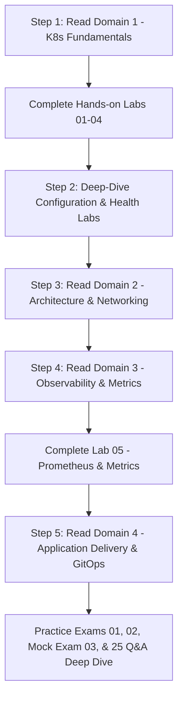
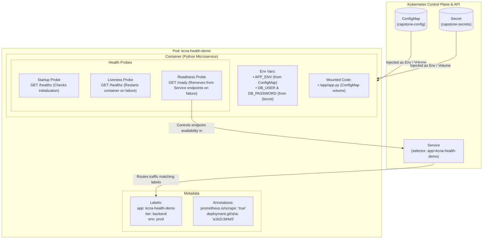

# ☸️ Kubernetes and Cloud Native Associate (KCNA) Study Guide & Practice Resources

[](https://github.com/fletchnj/kcna-study-guide/actions)
[](https://opensource.org/licenses/MIT)
[](https://kubernetes.io/)

Welcome to the ultimate **Kubernetes and Cloud Native Associate (KCNA)** preparation repository! This repository provides comprehensive study notes, hands-on lab exercises, production-ready YAML manifests, and full-length practice exams aligned directly with the official [Linux Foundation / CNCF KCNA Curriculum](https://github.com/cncf/curriculum/blob/master/KCNA_Curriculum_v1.0.pdf).

---

## 📊 KCNA Exam Overview

- **Exam Format:** 60 Multiple-Choice Questions
- **Time Limit:** 90 Minutes
- **Passing Score:** 75%
- **Certification Validity:** 2 Years
- **Administered By:** Linux Foundation & Cloud Native Computing Foundation (CNCF)

### 🎯 Official Curriculum Breakdown

| Domain | Weight | Topics Covered |
| :--- | :---: | :--- |
| [**1. Kubernetes Fundamentals**](./01-kubernetes-fundamentals/) | **46%** | Architecture, Pods, Deployments, Services, Storage, ConfigMaps, Secrets, Ingress |
| [**2. Cloud Native Architecture**](./02-cloud-native-architecture/) | **22%** | Microservices, Serverless, Storage (CSI), Networking (CNI), Service Mesh |
| [**3. Cloud Native Observability**](./03-cloud-native-observability/) | **18%** | Telemetry, Prometheus, Metrics, Logging (Fluentd/Loki), Tracing (OpenTelemetry) |
| [**4. Cloud Native Application Delivery**](./04-cloud-native-application-delivery/) | **14%** | CI/CD, GitOps (ArgoCD/Flux), Helm, Container Packaging & OCI Registries |

---

## 🚀 Quick Start & Study Roadmap



---

## 🩺 Deep-Dive Feature: Configuration & Health Lab Suite

A complete, production-grade interactive lab suite demonstrating the foundational Kubernetes workload configuration and reliability primitives:



### Modules in this Suite:
1. 🗺️ [**Module 01: ConfigMaps**](./01-configmaps/) — Decoupled configuration, environment variables, volume projections, and immutability (`immutable: true`).
2. 🔐 [**Module 02: Secrets**](./02-secrets/) — Sensitive credentials, Base64 encoding vs encryption, KMS, TLS certificates, and in-memory `tmpfs` mounts.
3. 🏷️ [**Module 03: Labels and Annotations**](./03-labels-and-annotations/) — Identifying vs non-identifying metadata, equality and set-based selectors, and tool integrations.
4. 🩺 [**Module 04: Health Probes**](./04-probes/) — Liveness, Readiness, and Startup probes, probe handlers (`exec`, `httpGet`, `tcpSocket`), and threshold tuning.
5. 🚀 [**Module 05: Capstone Microservice**](./05-capstone-app/) — A runnable zero-dependency Python microservice uniting all 5 concepts in one architecture.

---

## 🛠️ Hands-On Labs

Get practical experience running a local Kubernetes cluster (`kind` or `minikube`):

1. 🧪 [**Lab 01: Cluster Setup & Kubectl Basics**](./labs/lab-01-kind-cluster-setup.md)
2. 🧪 [**Lab 02: Deployments, Scaling & Health Probes**](./labs/lab-02-deploying-workloads.md)
3. 🧪 [**Lab 03: Networking, Services & Ingress**](./labs/lab-03-networking-and-services.md)
4. 🧪 [**Lab 04: ConfigMaps, Secrets & Persistent Volumes**](./labs/lab-04-config-and-storage.md)
5. 🧪 [**Lab 05: Observability with Prometheus & Metrics**](./labs/lab-05-observability-prometheus.md)

---

## 📝 Practice Exams & Quizzes

Test your knowledge before taking the real exam:

- ✍️ [**Exam 01: Kubernetes Fundamentals (25 Questions)**](./practice-exams/exam-01.md)
- ✍️ [**Exam 02: Architecture, Observability & Delivery (25 Questions)**](./practice-exams/exam-02.md)
- ✍️ [**Exam 03: Full 60-Question KCNA Mock Exam with Explanations**](./practice-exams/exam-03.md)
- ✍️ [**Configuration & Health Deep Dive: 25 Targeted Exam Questions & Rationales**](./practice-questions/KCNA_PRACTICE_QUESTIONS.md)

---

## ⚡ Essential `kubectl` Cheat Sheet

```bash
# Cluster Info & Nodes
kubectl cluster-info
kubectl get nodes -o wide

# Workloads
kubectl get pods --all-namespaces
kubectl run nginx --image=nginx:alpine --port=80
kubectl create deployment web --image=nginx:alpine --replicas=3
kubectl scale deployment web --replicas=5
kubectl rollout status deployment/web
kubectl rollout undo deployment/web

# Exposing Applications
kubectl expose deployment web --type=ClusterIP --port=80 --target-port=80
kubectl expose deployment web --type=NodePort --port=80

# Configuration & Health Inspection
kubectl get configmaps,secrets
kubectl get pods --show-labels
kubectl get pods -l 'tier in (frontend, backend)'
kubectl describe pod <pod-name> | grep -E "Liveness|Readiness|Startup"

# Debugging & Inspection
kubectl describe pod <pod-name>
kubectl logs -f <pod-name>
kubectl exec -it <pod-name> -- /bin/sh
kubectl top nodes
kubectl top pods
```

---

## 💻 Running the Labs

Validate all manifests in the repository:
```bash
make validate-manifests
```

Deploy the modules:
```bash
# Deploy all configuration & health demonstrations
make deploy-all

# Clean up all created resources
make clean
```
