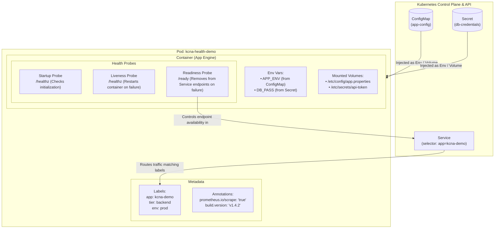

# KCNA Certification Lab: Configuration & Health ☸️

[](https://github.com/duane-fletcher/kcna-configuration-and-health/actions)
[](https://opensource.org/licenses/MIT)
[](https://kubernetes.io/)

A complete, production-grade hands-on laboratory and study guide for the **Linux Foundation & Cloud Native Computing Foundation (CNCF) KCNA (Kubernetes and Cloud Native Associate)** certification exam.

This repository focuses on the core **Configuration & Health** domain:
- 🗺️ **ConfigMaps** (Decoupled configuration, environment variables, volume projections, immutability)
- 🔐 **Secrets** (Sensitive data handling, base64 encoding vs encryption, secret types, security considerations)
- 🏷️ **Labels & Selectors** (Identification, grouping, loose coupling, equality & set-based filtering)
- 📝 **Annotations** (Tooling metadata, ingress/monitoring directives, non-identifying records)
- 🩺 **Health Probes** (Liveness, Readiness, Startup, probe handlers, threshold tuning)

---

## 📐 Architecture Overview

The following diagram illustrates how each of the five core concepts integrates into a single Kubernetes Pod:



---

## 📊 KCNA Exam Cheat Sheet & Comparison Matrices

### 1. ConfigMaps vs. Secrets

| Feature | ConfigMap | Secret | KCNA Exam Note |
| :--- | :--- | :--- | :--- |
| **Primary Purpose** | Non-confidential configuration (flags, URLs, property files) | Sensitive credentials (passwords, tokens, TLS certificates) | Never put plaintext secrets in ConfigMaps. |
| **Encoding / Encryption** | Plain UTF-8 text | Base64-encoded by default (RFC 4648) | ⚠️ Base64 is **NOT** encryption. At-rest encryption requires KMS or `EncryptionConfiguration`. |
| **Max Size** | 1 MiB | 1 MiB | Both have a strict 1 MiB limit imposed by `etcd`. |
| **Standard Types** | Single default kind | `Opaque`, `kubernetes.io/tls`, `kubernetes.io/dockerconfigjson`, `kubernetes.io/service-account-token` | `Opaque` is the default generic secret type. |
| **Injection Methods** | `valueFrom.configMapKeyRef`, `envFrom`, Volume mount | `valueFrom.secretKeyRef`, `envFrom`, Volume mount | Volume mounts update automatically (eventually); environment variables do **not** update without pod restart. |
| **Immutability** | Supported (`immutable: true`) | Supported (`immutable: true`) | Protects against accidental updates and reduces API server watch load. |

---

### 2. Labels vs. Annotations

| Characteristic | Labels (`metadata.labels`) | Annotations (`metadata.annotations`) |
| :--- | :--- | :--- |
| **Primary Intent** | Identifying and selecting resources | Non-identifying metadata and operational directives |
| **Used by Selectors?** | **YES** (`kubectl get -l`, `Service.spec.selector`, `Deployment.spec.selector`) | **NO** (Cannot be queried using label selectors) |
| **Characters & Syntax** | Strict: max 63 chars for name, alphanumeric, `-`, `_`, `.` | Flexible: supports arbitrary strings, structured JSON/YAML payloads |
| **Typical Use Cases** | `app: frontend`, `env: production`, `release: stable`, `tier: backend` | Ingress rules (`kubernetes.io/ingress.class`), monitoring flags (`prometheus.io/scrape: "true"`), CI/CD commit hashes |

---

### 3. Health Probes Comparison

| Probe Type | What it Answers | Action when Failed | KCNA Exam Scenario |
| :--- | :--- | :--- | :--- |
| **Startup Probe** | *"Has the container finished booting up?"* | Container is killed and subject to restart policy. | Use when an application takes 60+ seconds to load cache/DB before accepting traffic, preventing liveness probe from killing it early. |
| **Liveness Probe** | *"Is the application in an unrecoverable state/deadlocked?"* | Container is **killed and restarted** by the kubelet. | Deadlock, memory leak loop, or fatal crash where a process restart resolves the issue. |
| **Readiness Probe** | *"Is the application currently able to process user traffic?"* | Pod IP is **removed from Service Endpoints** (no restart). | Temporary overloading, warmup, warming caches, or dependent database transient outage. |

#### Probe Handlers:
1. `httpGet`: Performs an HTTP GET request (returns status code between 200 and 399 for success).
2. `tcpSocket`: Checks if a TCP port is open and listening.
3. `exec`: Executes a command inside the container (exit code `0` is success, non-zero is failure).
4. `grpc`: Checks health via gRPC health checking protocol.

---

## 📁 Repository Structure

```
├── 01-configmaps/               # Decoupled config: literal, env, volumes, immutability
│   ├── README.md
│   ├── 01-literal-env-configmap.yaml
│   ├── 02-volume-configmap.yaml
│   ├── 03-immutable-configmap.yaml
│   └── 04-demo-pod.yaml
├── 02-secrets/                  # Sensitive credentials, base64 encoding, TLS, secret helper
│   ├── README.md
│   ├── 01-opaque-secret.yaml
│   ├── 02-tls-secret.yaml
│   ├── 03-demo-pod.yaml
│   └── scripts/secret-helper.sh
├── 03-labels-and-annotations/   # Selectors, equality/set-based filtering, tooling metadata
│   ├── README.md
│   ├── 01-labeled-pods.yaml
│   ├── 02-service-selector.yaml
│   ├── 03-node-selector-pod.yaml
│   └── 04-annotated-pod.yaml
├── 04-probes/                   # Liveness, Readiness, and Startup probe mechanics
│   ├── README.md
│   ├── 01-liveness-exec.yaml
│   ├── 02-readiness-http.yaml
│   ├── 03-startup-probe.yaml
│   └── 04-multi-probe-app.yaml
├── 05-capstone-app/             # Complete microservice integrating all 5 topics
│   ├── README.md
│   ├── app.py
│   ├── Dockerfile
│   ├── deployment.yaml
│   └── service.yaml
├── practice-questions/          # 25+ KCNA exam-style multiple-choice questions & answers
│   └── KCNA_PRACTICE_QUESTIONS.md
├── scripts/                     # Local cluster bootstrap and automated lab runner
│   ├── setup-cluster.sh
│   └── run-all-labs.sh
├── Makefile                     # Build and management tasks
└── LICENSE                      # MIT License
```

---

## 🚀 Quickstart Guide

### Prerequisites
- A working Kubernetes cluster: [Minikube](https://minikube.sigs.k8s.io/), [Kind](https://kind.sigs.k8s.io/), [k3d](https://k3d.io/), or Docker Desktop Kubernetes.
- `kubectl` configured to communicate with your cluster.

### 1. Validate all manifests locally
```bash
make validate-manifests
```

### 2. Run Module Labs Sequentially

```bash
# Module 1: ConfigMaps
make deploy-configmaps

# Module 2: Secrets
make deploy-secrets

# Module 3: Labels and Annotations
make deploy-labels

# Module 4: Health Probes
make deploy-probes

# Module 5: Capstone Application
make deploy-capstone
```

### 3. Cleanup
```bash
make clean
```

---

## 🎯 Studying for the KCNA?

Make sure to review:
1. The **Hands-on Labs** in each numbered folder.
2. The **[KCNA Practice Questions](practice-questions/KCNA_PRACTICE_QUESTIONS.md)** containing 25+ high-yield exam questions with comprehensive rationales.
